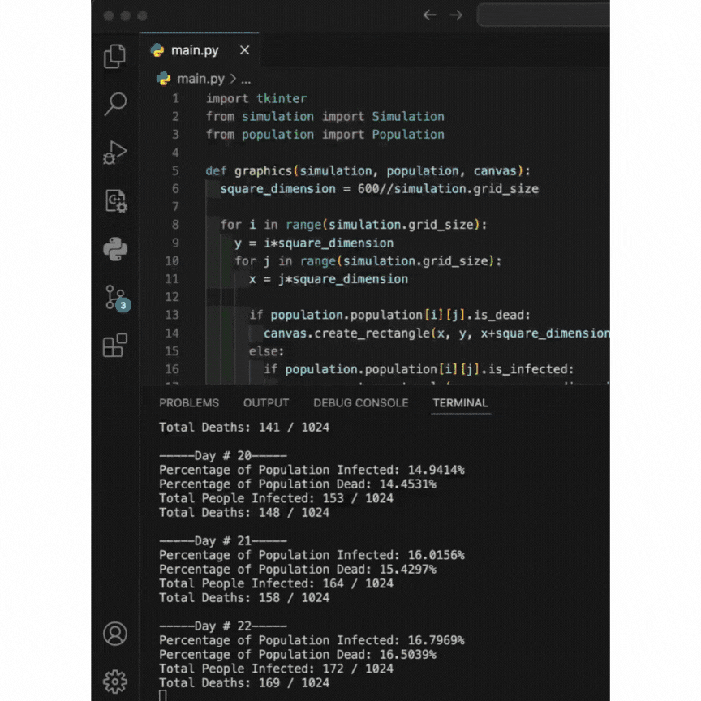

# Welcome to the Epidemic Simulator App

This application is a simple program that simulates disease spread across the community according to the following properties,

1. Population size(number of humans).
2. Percentage (0-100) of the population to initially infect.
3. Probability (0-100) that a person gets infected when exposed to the disease.
4. Duration (in days) of the infection.
5. Mortality rate (0-100) of the infection.
6. Number of days to simulate.

Run the `main.py` file to see the simulation in a window.
```
python main.py
```
Once you hit enter, you must enter values for these questions before starting the simulation. 
```
Enter the population size(number of humans): 1000
Rounding population size to 1024for visual purposes.
Enter the percentage (0-100) of the population to initially infect: 3
Enter the probability (0-100) that a person gets infected when exposed to the disease: 50
Enter the duration (in days) of the infection: 14
Enter the mortality rate (0-100) of the infection: 60
Enter the number of days to simulate: 365

-----Day # 1-----
Percentage of Population Infected: 3.0273%
Percentage of Population Dead: 0.0%
Total People Infected: 31 / 1024
Total Deaths: 0 / 1024
Press Enter to begin simulation.
```
## Sample runner

